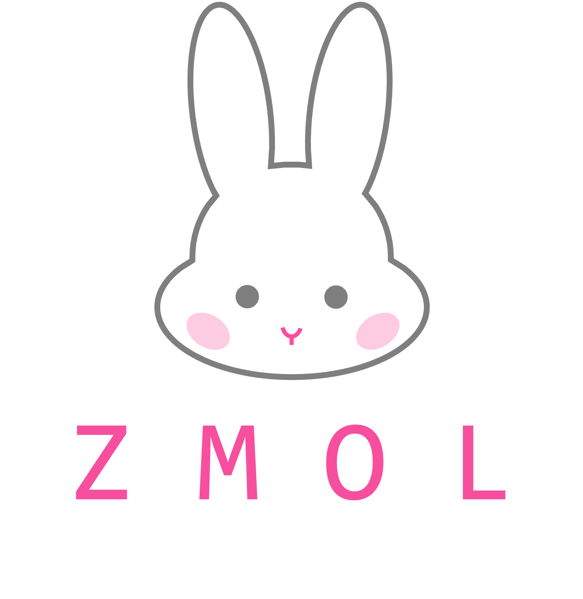
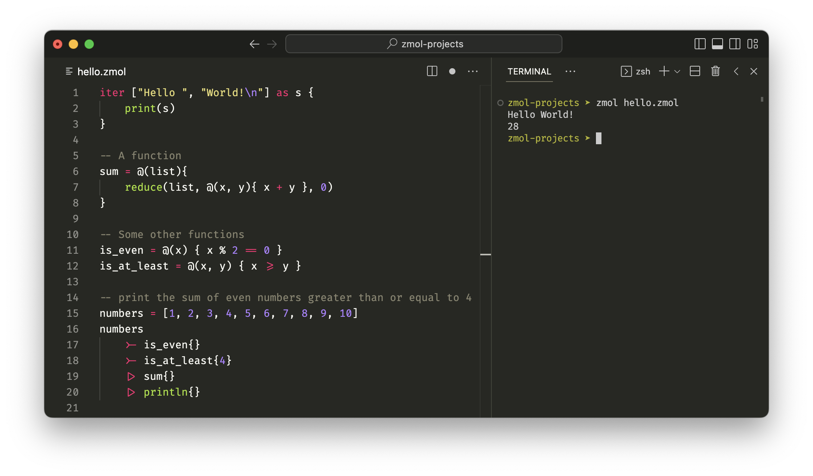

# Zmol

    

A toy language that aims to be:

- The abuser of Fira Code font ligatures
- Easily embeddable in Go
- Concise; you can learn over a weekend
- Able to solve non-trivial problems (like hello world)
- Zmol in size

Refer to the [docs](docs.md) for more information.

## 0.1.0 Roadmap

- [x] A tree-walking interpreter. Not necessarily a fast one. No error types nor error handling. Program mostly will just terminate on error. This will be replaced by a bytecode VM in the next version.
- [ ] Basic types
    - [x] Integers
    - [x] Floats
    - [x] Strings
    - [x] Booleans
    - [x] List
    - [ ] Maps
- [x] Functions and closures
- [x] Objects
    - [x] Classes
    - [x] Instances
    - [x] Methods
    - [x] Inheritance
- [ ] Modules

## 0.2.0 Roadmap

- [ ] A bytecode compiler and VM
- [ ] A REPL
- [ ] Error handling